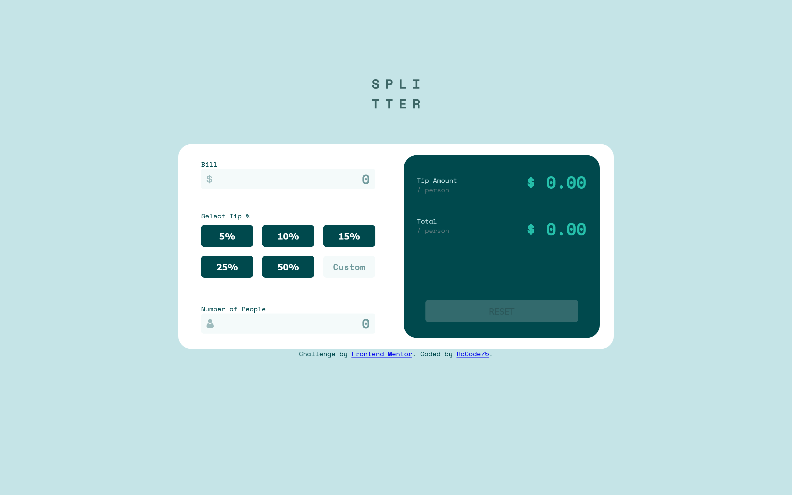
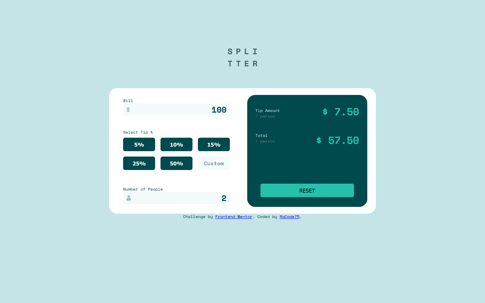
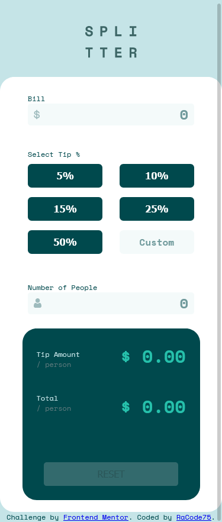

# Frontend Mentor - Tip calculator app solution

This is a solution to the [Tip calculator app challenge on Frontend Mentor](https://www.frontendmentor.io/challenges/tip-calculator-app-ugJNGbJUX). Frontend Mentor challenges help you improve your coding skills by building realistic projects.

## Table of contents

- [Overview](#overview)
  - [The challenge](#the-challenge)
  - [Screenshot](#screenshot)
  - [Links](#links)
- [My process](#my-process)
  - [Built with](#built-with)
  - [What I learned](#what-i-learned)
  - [Continued development](#continued-development)
  - [Useful resources](#useful-resources)
- [Author](#author)


### The challenge

Users should be able to:

- View the optimal layout for the app depending on their device's screen size
- See hover states for all interactive elements on the page
- Calculate the correct tip and total cost of the bill per person

### Screenshot





### Links

- Solution URL: [Add solution URL here](https://your-solution-url.com)
- Live Site URL: [Add live site URL here](https://your-live-site-url.com)

## My process

HTML structure first, with paper I fragmented the layout and saw approximately how much tags I need and how to nest them, later reduce them to the minimum necessary.
Then SCSS to actually style the structure.
Finally added the interactivity with Javascript via the DOM and modify to the simplest solution (in my point of view).

### Built with

- Html5
- Css, SASS
- Javascript
- Flexbox
- Mobile-first workflow

### What I learned

To see how you can add code snippets, see below:

```html
<span class='rotulo' id='bill'>Bill<span id='b_error'></span></span>
```
```css
         #bill_in{
             background-image: url('../images/icon-dollar.svg');
             background-repeat: no-repeat;
             background-position: left;
             background-position-x: 10px;
         }
```
```js
// Buttons------------------------------------
const b_percent = document.getElementsByClassName('bill_b');
//---------------Lisneners-------------------
for(let b_perc of b_percent){    
    if(b_perc.id !== "custom"  ){
        b_perc.addEventListener('click', function(){  
                percent = parseFloat(b_perc.id)/100;
                prueba();        
            });
        }else{
        b_perc.addEventListener('focus', (e) => {b_perc.value = ''});
        b_perc.addEventListener('keyup', function(){
            if(custom.value !== 'Custom' && custom.value!== ''){
            percent = parseFloat(custom.value)/100;
            prueba();
            }
        });
        }

     }

### Continued development

- Layouts
- Javascript
-Front and Backend

### Useful resources

- [Example resource 1](https://www.w3schools.com/) - The best for a quick refresh.

## Author

- Website - [Add your name here](https://www.racode75.com.ar)
- Frontend Mentor - [@RaCode75](https://www.frontendmentor.io/profile/RaCode75)

